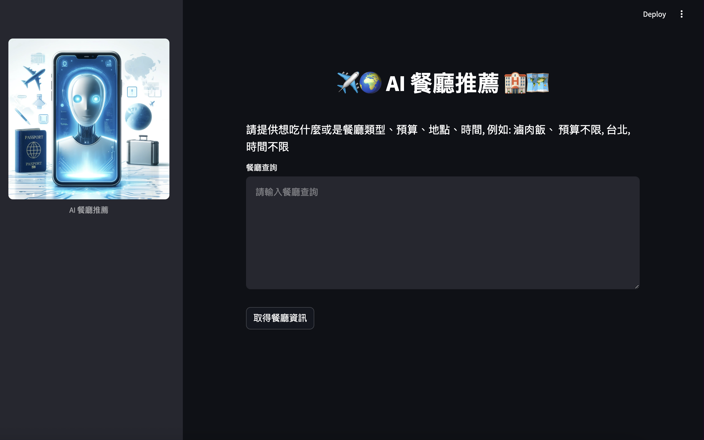

# 🍽️ AI 餐廳代理 - 智能餐廳助手

這是一個基於 LangGraph 開發的智能餐廳代理系統，能夠幫助用戶進行餐廳預訂、菜品推薦和用餐體驗優化。該系統利用多個語言模型（LLMs）來處理各種任務，為用戶提供無縫的餐廳服務體驗。



## ✨ 主要功能

- **智能預訂系統**：自動處理餐廳預訂，包括時間選擇和座位安排
- **個性化推薦**：根據用戶偏好和歷史記錄推薦合適的菜品
- **多語言支持**：支持多種語言交互，確保國際用戶的順暢體驗
- **即時反饋**：收集用戶評價並提供即時服務改進建議
- **狀態追蹤**：記錄用戶互動歷史，確保服務的連續性

## 🚀 快速開始

### 環境要求
- Python 3.11+
- Docker (可選)

### 安裝步驟(使用docker)

1.安裝docker

2. 複製專案
```bash
git clone https://github.com/shenghongtw/ai-restaurant-agent
cd ai-restaurant-agent
```

3. 配置環境變量
```bash
cp .env_example .env
```
編輯 `.env` 文件，填入必要的 API 密鑰：
```plaintext
OPENAI_API_KEY=your_openai_api_key
```

4. 啟動應用
```bash
# 使用 Poetry
poetry run streamlit run ai_agent/app.py

# 或使用 Docker
docker-compose up -d
```

## 🛠️ 技術架構

- **前端**：Streamlit
- **後端**：Python FastAPI
- **AI 模型**：OpenAI GPT
- **ai agent**：LangGraph
- **容器化**：Docker

## 📝 使用示例

1. 啟動應用後，在瀏覽器中訪問 `http://localhost:8501`
2. 輸入您的用餐需求，例如：
   > "我想在週六晚上吃滷肉飯、預算不限、地點在台北,推薦我餐廳"

3. 系統會自動：
   - 搜索符合條件的餐廳
   - 推薦合適的菜品
   - 處理預訂流程
   - 提供詳細的用餐建議
